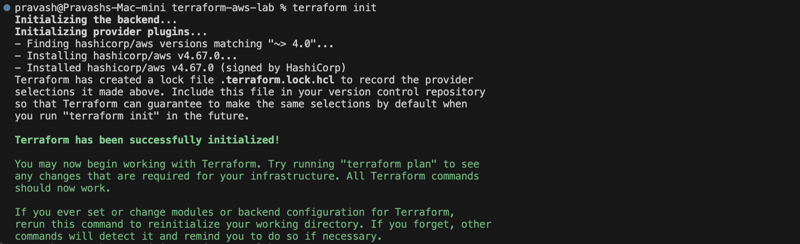

## 🚀 Terraform & AWS Lab: Your First Cloud Automation Project

> _“Imagine Learning Terraform during your summer vacations when you're on 11th Grade?! This is going to be that simple!!”_

Welcome to my hands-on Terraform + AWS lab! This guide will take you through every single step, from setting up your AWS credentials to writing your first Terraform configuration. I’ll explain everything in a way that’s easy to understand, even your tech-savvy 15-year-old cousin could follow along. So, grab your **laptop** and let’s get started!


---

## 📋 Table of Contents

1. Prerequisites
2. Project Structure
3. Step 1: Create an AWS IAM User 
4. Step 2: Install & Configure the AWS CLI 
5. Step 3: Install Terraform
6. Step 4: Write Your Terraform Configuration
   - provider.tf  
   - variables.tf  
   - main.tf  
   - outputs.tf  
7. Step 5: Initialize, Plan, and Apply
8. Step 6: Verify Your Resources
9. Step 7: Clean Up (Destroy)
10. Next Steps & Challenges

---

## 🛠️ Prerequisites

Before we start, make sure you have:

- A free [AWS account](https://aws.amazon.com/free/)  
- A computer (Windows, macOS, or Linux) with:
  - Internet access  
  - Administrator rights to install software  

---

## 📁 Project Structure

When we’re done, your folder will look like this:

terraform-aws-lab/

    ├── provider.tf
    ├── variables.tf
    ├── main.tf
    └── outputs.tf


---

## 👤 Step 1: Create an AWS IAM User

1. **Log in** to the [AWS Management Console](https://console.aws.amazon.com/).  
2. In the top search bar, type **IAM** and click **IAM**.  
3. In the sidebar, click **Users** → **Add users**.  
4. Enter a **User name** (e.g. `terraform-lab-user`).  
5. Under **Select AWS access type**, check **Programmatic access**.  
6. Click **Next: Permissions**.  
7. Choose **Attach existing policies directly** → search for and check **AdministratorAccess** (for learning only; in real projects, give minimal permissions!).  
8. Click **Next: Tags** → you can skip or add tags → **Next: Review**.  
9. Click **Create user**.  
10. On the success page, **Download .csv** or copy the **Access key ID** and **Secret access key**.  
    > 🔒 Keep these safe—they let Terraform talk to AWS!

---

## 💻 Step 2: Install & Configure the AWS CLI

1. **Install**:  
   - **macOS**:  
     ```bash
     brew install awscli
     ```  
   - **Windows**: Download & run the MSI from https://aws.amazon.com/cli/  
   - **Linux**:  
     ```bash
     curl "https://awscli.amazonaws.com/awscli-exe-linux-x86_64.zip" -o "awscliv2.zip"
     unzip awscliv2.zip
     sudo ./aws/install
     ```
2. **Configure** (enter the keys you got):  
   ```bash
   aws configure
   ```
   - AWS Access Key ID: 🔑  
   - AWS Secret Access Key: 🔑  
   - Default region name: `us-east-1` (or your favorite)  
   - Default output format: `json`

    
3. **Test**:  
   ```bash
   aws sts get-caller-identity
   ```
   You should see your **UserId** and **Account** details!

---

## 📦 Step 3: Install Terraform

1. **Download** the latest Terraform from https://www.terraform.io/downloads.html  
2. **Unzip** and move to your PATH.  
   - **macOS / Linux** example:
     ```bash
     unzip terraform_*.zip
     sudo mv terraform /usr/local/bin/
     ```
3. **Verify**:
   ```bash
   terraform version
   ```

---

## ✍️ Step 4: Write Your Terraform Configuration

Create a new folder `terraform-aws-lab/` and inside it, create four files.

### 1. `provider.tf`
You can always copy the latest available provider details from [Terraform Website](https://registry.terraform.io/providers/hashicorp/aws/latest) or mention as below for above a certain version.
```hcl
terraform {
  required_version = ">= 1.0.0"
  required_providers {
    aws = {
      source  = "hashicorp/aws"
      version = "~> 4.0"
    }
  }
}

provider "aws" {
  region = var.aws_region
}
```

> **Why?**  
> - Defines which provider (AWS) and version to use.  
> - Sets the AWS region from a variable. We're actually not hardcoding the region. It's a best practice for flexibility, reusability and clean design.

---

### 2. `variables.tf`

```hcl
variable "aws_region" {
  description = "The AWS region to create resources in"
  type        = string
  default     = "us-east-1"
}

variable "bucket_name" {
  description = "A unique name for the S3 bucket"
  type        = string
}
```

> **Why?**  
> - `aws_region`: So you can change regions easily without editing the .tf code (Applying the environmental variables or create a terraform.tfvars file or dynamically in scripts or pipelines)
> - `bucket_name`: Since we've not set the default, it forces us to pick a unique S3 bucket name.

---

### 3. `main.tf`

```hcl
# Create an S3 bucket
resource "aws_s3_bucket" "lab_bucket" {
  bucket = var.bucket_name
  acl    = "private"

  tags = {
    Name        = "TerraformLabBucket"
    Environment = "Dev"
  }
}

```

> **Why?**  
> - Provisions a simple S3 bucket whose name has to be manually entered during terraform plan.
> - Terraform will name the resource internally as `aws_s3_bucket.lab_bucket`.
> - `bucket = var.bucket_name` sets the actual S3 bucket name that we're pulling from the `variables.tf`. Additionally, we can pass this value through different input variables.
> - The reason we're using a variable to create a bucket name is because S3 bucket names must be **globally unique**, so we can't hardcode and reuse the same names across envs. or projects.

---

### 4. `outputs.tf`

```hcl
# Output the bucket domain name
output "bucket_domain_name" {
  description = "The DNS name of the S3 bucket"
  value       = aws_s3_bucket.lab_bucket.bucket_domain_name
}
```
> _(You can either include in the `main.tf` or split!)_

> **Why?**  
> - `bucket_domain_name` is a terraform attribute provided by AWS provider which gives us the DNS endpoint that we can use to access the bucket **(if it's public)**
> - We can use this value to access public files via a URL, Integrate with CloudFront or Set up website hosting.
> - Also helpful to **pass outputs** from one module to another, **Connect resources together** and can be used **automatically in CI/CD pipelines**.

---

## ⚙️ Step 5: Initialize, Plan, and Apply

From your `terraform-aws-lab/` folder:

1. **Initialize**  
   ```bash
   terraform init
   ```
   - Downloads the AWS provider plugin.
   

2. **Validate & Plan**  
   ```bash
   terraform validate
   ```
   - `validate` checks syntax.  
   
   Let's understand in detail about the warning. It' a **Older Code** and triggered this deprecation code expects us to do this separately using `aws_s3_bucket_versioning`. We'll understand the correct way (modular, new style) in the later sections. For now, just understand that S3 buckets can have multiple independent features (versioning, encryption, replication, logging, etc.) and Managing them separately is cleaner, more modular, easier to maintain.
  
   ```bash
   terraform plan -out=tfplan
   ```
   - `plan` shows what will happen.
   
   Let's understand why I used the command `terraform plan -out=tfplan` instead of the regular `terraform plan`.

      
   It guarantee that what we saw during `plan` is exactly what we apply. This is super important during Production Deployments, CI/CD automation.
   The **RISK** in doing a regular `terraform plan` and `terraform apply` is that they are separate and resources might have changed between them.
   However, The Professional/Production way is to do: `terraform plan -out=tfplan`, `terraform show tfplan` & `terraform apply tfplan` and ✅ Now what you planned is 100% what you apply. No surprises.

3. **Apply**  
   ```bash
   terraform apply "tfplan"
   ```
   - Type **yes** when prompted.  
   - Watch AWS spin up your S3 bucket!
   

---

## 🔍 Step 6: Verify Your Resources

- In the AWS Console → S3 → you should see your new bucket.

- Back in your terminal, Terraform will have printed your `bucket_domain_name`.
  
---

## 🧹 Step 7: Clean Up (Destroy)

When you’re done:

```bash
terraform destroy -auto-approve
```
 
This removes all resources Terraform created, so you don’t get any surprise AWS bills.

---

## 🎯 Next Steps & Challenges

1. **Add a DynamoDB table** to your lab:  
   - Create `aws_dynamodb_table` resource.  
   - Practice defining keys & attributes.

2. **Use variables and locals** to configure tags dynamically.  

3. **Experiment** with other AWS services:  
   - EC2 instances  
   - IAM roles & policies  
   - VPC networks  

4. **Challenge**:  
   - Write a Terraform module that creates both an S3 bucket and a DynamoDB table in one reusable package.

---

👏 **Congratulations!**  
You’ve just automated cloud infrastructure with Terraform on AWS. Keep exploring, tweaking variables, and trying new AWS services. Cloud automation awaits! 🚀  

```